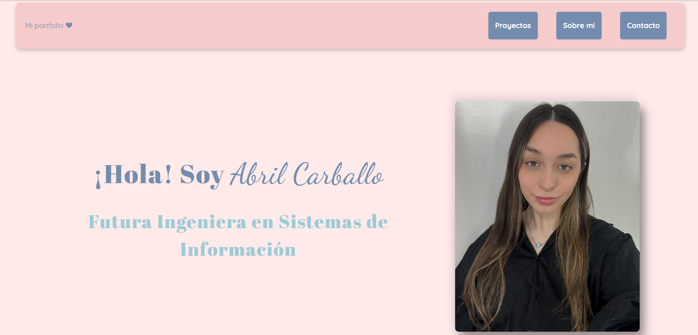
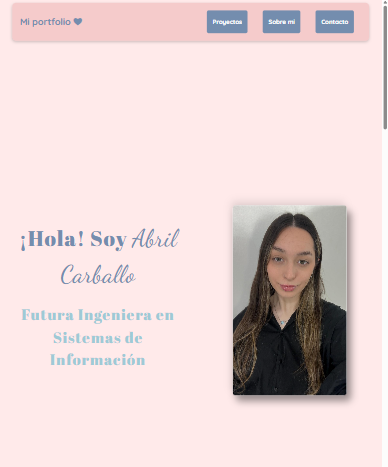
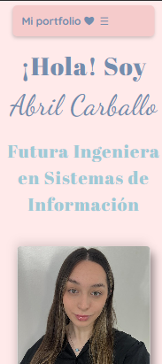

# Mi Portfolio ❤

## ✏ Descripción 
Este es mi portfolio personal, donde se muestran mis proyectos, habilidades y datos de contacto. Incluye un diseño responsive que se adapta a móviles, tablets y escritorio, con un menú tipo hamburguesa para dispositivos pequeños y tarjetas de proyectos con efecto flip.

## ⌨ Tecnologías utilizadas 
- HTML5
- CSS3 (Flexbox, Media Queries, Pseudo-clases)
- JavaScript (para interacciones como menú y tarjetas)

## ↳ Enlace al sitio
[Ver mi portfolio en GitHub Pages](https://abril-carballo.github.io/portfolio-abril-carballo/)

## ⥱ Próximas mejoras 

- Revisar y optimizar **media queries** para tablets y móviles, asegurando que todas las secciones se vean compactas.  
- Mejorar la interacción táctil en tarjetas y elementos hover para que funcionen de manera intuitiva en dispositivos móviles y tablets.  
- Posible incorporación de animaciones más suaves y consistentes en transiciones de imágenes y tarjetas.  
- Añadir accesibilidad avanzada, como navegación completa con teclado y lectores de pantalla.

## ⌨ Previsualización

### Versión escritorio

### Versión tablet

### Versión móvil

